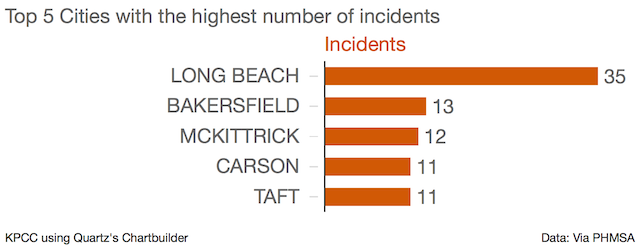

California Pipeline Operator Data 
====================================

1. The data was scraped from [here](http://primis.phmsa.dot.gov/comm/reports/operator/OperatorListNoJS.html) using two web scrapers. Details on those can be found in our [tools and scripts folder](https://github.com/SCPR/kpcc-data-team/tree/master/tools-and-scripts/pull-california-pipeline-operators)

How it Works
------------
After the [Santa Barbara pipeline spill](http://www.scpr.org/news/2015/06/01/52117/things-to-know-about-the-california-oil-spill) in June, 2015, we wanted to know more about pipelines operated in California. Who operates in the state, what kinds of pipelines do they operate, and who causes the most damage? All of that info is available on the Pipeline and Hazardous Materials Safety Administration (PHMSA) website, but the data isn't in an easily analyzable formate. Looking at the list of operators, we don't know what states they operate in or what kinds of damage they do. We decided to fix that.

There are two web scrappers here: cali-pipeline-ops-to-csv.py and pipeline-incident-details.py. Both scrapers are built using BeautifulSoup and go through the PHMSA website and gather info on pipelines, allowing us to gain some good insights.

The first scraper's job is to gather information on operators only within the state of California. The main page doesn't give any indication of what states the operator has pipelines in, so the script opens up the page and checks. It then grabs basic information on each operator, such as the name, incidents, inspections, enforcement actions, and what kinds of pipelines the company operates and how many miles.

The scraper grabs the information and adds each category to a list of dictionaries, converts it into a pandas dataframe and exports it to a csv. The data, taken direcly from the website, isn't really suitable for analysis because all of the numbers and dollars aren't stored as integers. Using pandas, its very easy to clean up the data.

The second scraper does a bit more involved job. Each pipeline operator has its own page, which has much more detailed info on pipeline failures. [Example](http://primis.phmsa.dot.gov/comm/reports/operator/OperatorIM_opid_2616.html?nocache=2666#_Incidents_tab_4) This is where the juicy info on each pipeline is.

Not every pipeline's details page is structured the same way, so the scraper opens each page and figures out the div tag for the details table. It jumps into the table and combs through the information, sanitizing the text and numbers, removing bizarre unicode and unnecessary spaces, and adds each row to a list of lists. It then writes the list of lists to a csv using python's built-in csv writer functions.

The details page for each operator gives some very detailed info on pipeline accidents. In addition to the cost of property damage, we also get the cause and sub-cause of the pipeline failure, as well as the city, state, and county of the failure.

Explanation of some of the categories
------------------------------------
 
A note on what some of the different categories mean. No government dataset would be complete without some jargon and though most are fairly straight forwards, I'll define any that might be unclear
* Hazardous Liquids: You can check the full list of possible fluids and gases transported [here](http://primis.phmsa.dot.gov/comm/FactSheets/FSProductList.htm?nocache=2022), but in general, PHMSA defines hazardous liquids as "hydrocarbon liquids", so crude oil and refined petroleum. 
* Gas: Gas pipelines transport non-liquid products such as butane and natural gas
* Federal and state inspected miles: Pipeline operators have to submit to both federal and state inspections. Information of the various state regulators can be found [here](http://phmsa.dot.gov/pipeline/state-programs) and information on the federal laws that must be obeyed can be read [here](http://phmsa.dot.gov/pipeline/stateprograms/federalstateauthorities)

Analyzing the data 
------------------
Guiding Questions 

* Who are the biggest offenders in California?
* Is there a relation between mileage operated and number of incidents? What are the incidences per mile? 
* What is the most common cause of pipeline failure?
* What areas have been hit the hardest? 

There are 98 companies operating pipeline in CA. There have been 273 incidents in California since 2006, caused by 34 different pipeline operators. However, the majority of the incidents have been caused by a small number of companies.

However, this doesn't give us a full picture for the worst offenders in the state, because some of the companies operate vastly different quantities of pipeline.

Calculating the number of incidents per mile gives us a better idea of which companies have pipelines that are consistently breaking. We can see that Bp West Coast has a very high number of incidents per mile, even though they only have 161 miles. 

There have been 9 fatalities and 62 injuries, all caused by the same pipeline operator, Pacific Gas and Electric, in two separate incidences. The largest incident, [the San Bruno pipeline explosion](http://www.scpr.org/news/2015/04/09/50901/california-regulator-suggests-utility-pg-e-is-too/), caused over $300 million in damages and killed 8 people.

In total, 6,054,736 barrels of hazardous liquid have been spilled by 31 different operators since 2006. Only three operators spilled more than 10,000 barrels. The next highest spiller lost 7,218 barrels. A huge part of PG&E's lead is the San Bruno explosion.

The most common cause of pipeline failures are material/weld/equipment failure and corrosion. 

Long Beach is by far the city with the highest number of incidents, which may make sense given that Long Beach is right next to the Port of Long Beach, one of the busiest in the world. Though the port is actually in Los Angeles, it makes sense that there would be a lot of operators in the city.

However, looking only within Long Beach, we can see which pipelines have the highest incident rate. Using the collected data, we could replicate this for any city in California. 

