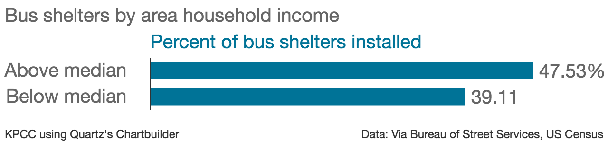

##What's in this repo

The **la_bus_shelters.011316.csv** file contains data on bus shelters. The file contains five columns from the PDF provided by Bureau of Street Services (id, furn_type, address, permit_issued and installed) as well as the latitude and longitude, which we geocoded. We received this file in January 2016.

This data was behind [this map](http://projects.scpr.org/maps/bus-shelters/).

Also in this repo are two charts created in exploring the shelters data.

Feel free to get in touch with Aaron with questions at amendelsonATscprDOTorg