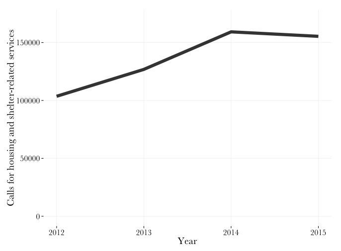

##211 call data on housing and shelter
In June 2016, KPCC received some data from [211](https://www.211la.org/) on calls to the resource line. As 211 is not a government agency — it's a non-profit that contracts with the County — it's not subject to CPRA.

The files were sent seperated out by year, and with color highlights to indicate which categories were related to housing and shelter. I combined the files into a single csv, and added a field to show which calls are related to housing and shelter. That is attached here as [calls211.csv](/calls211.csv). The calls are broken down by year and call type.

##What does the data show?
* The 211 data shows more than half a million calls for housing and shelter-related services between 2012 and 2015 (545,031). That's more than a fifth of 2.7 million calls to the service in those four years (20.36%).
* The percent of calls related to housing and shelter is on the rise. It went from 16.8 percent in 2012 to 22.7 percent in 2015, and rose each of the last three years.
	* The volume of these calls was 155,374 last year, 50,000 calls more than 211 received regarding housing and shelter in 2012.
	* The highest raw number of calls was in 2014, with 159,247. Because there was a higher number of calls overall, that was a smaller *share* of calls than in 2015 (21.1% vs 22.7%)
* Emergecy shelter calls are the single most common type of call recieved by 211, out of more than 200 categories.
	* The organizaiton has received 195,788 calls about emergency shelter between 2012 and 2015. The hotline has received tens of thousands of housing-related calls in recent years, and calls about housing counseling and transitional shelter are also among the most common.

Here's the growth in calls regarding housing/shelter over the last few years:

By 211's count they also receive tens of thousands of 'emergency food' calls each year.

#####Here the the cateogries included in the housing/shetler tag, and number of calls, 2012-2015
* Emergency Shelter (195788)
* Case Management (69727)
* Housing Counseling/Search Assistance (69690)
* Transitional Shelter/Housing (60272)
* Housing Expense Assistance/Home Loans (36115)
* Permanent Housing: Independent Settings (34314)
* Housing Administrative Agencies (17954)
* Housing Counseling/Search/Information (15287)
* Homeless Support Services (13898)
* Subsidized Housing (11471)
* Housing Payment Assistance (9795)
* Permanent Housing: Supportive Settings (4731)
* Shelters (3240)
* Other Housing (2749)
