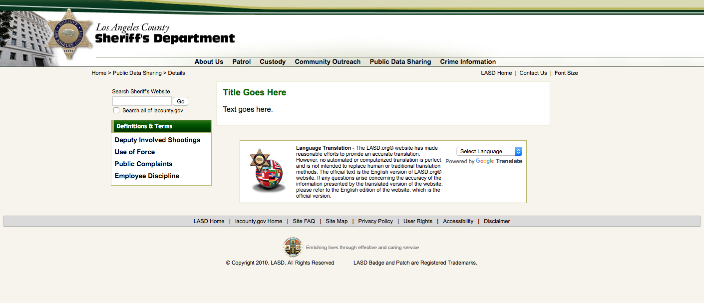

# LASD shootings data

After a KPCC California Public Records Act request seeking an updated version of Los Angeles Sheriff's Department data on deputy-involved shootings, a page featuring that data in PDF form was removed from the department's website.

In a statement, the LASD said that decision was made in response to [concerns raised by Association for Los Angeles Deputy Sheriff's](http://projects.scpr.org/documents/#document=2941429-ALADS-Letter-to-LASD/), the union representing the rank and file deputies.

While [some of the data is posted to LA County's portal](https://data.lacounty.gov/Criminal/Deputy-Details-Hit-Shooting-Incidents-and-Non-Hit-/7jc3-gsk7) it lacks fields such as if the deputy's force and tactics were found to be in policy, and if the deputy was disciplined. That information (which the LAPD makes public, though not in a strucutred format) is an important public look into the police shootings, [which can often be opaque](http://projects.scpr.org/officer-involved/stories/the-black-box/).

# What's here

KPCC pulled down all the PDFs linked to on the page in early June, when they were still available. Those are in the [lasd_public_data_page_pdfs](./lasd_public_data_page_pdfs) folder. It includes PDFs posted by the department on hit, non-hit, animal, warning shot and unintentional discharge incidents.

We've also downloaded [csv versions](./csv/) of deputy involved shooting data that is made available through the Los Angeles County Sheriff Department's ["Public Data Sharing" website](http://www.la-sheriff.org/s2/page_render.aspx?pagename=info_main).

# Before and after
[Before](https://webcache.googleusercontent.com/search?q=cache:http://www.la-sheriff.org/s2/page_render.aspx?pagename=info_detail_03): as of May 13, 2016 10:51:49 GMT.

[After](http://www.la-sheriff.org/s2/page_render.aspx?pagename=info_detail_03):

LASD Captain Christopher Reed said that the data was removed from that page on June 21, 2016. The three fields had been removed from the county data site on January 5, 2016.

Get in touch at amendelsonATscprDOTorg

*Data from our [Officer Involved investigation](http://projects.scpr.org/officer-involved/) into police shootings [is available here](https://github.com/SCPR/kpcc-data-team/tree/master/data/kpcc-officer-involved).*

*Follow our ongoing coverage [here](http://projects.scpr.org/internal/tools/topic-pages/).*
